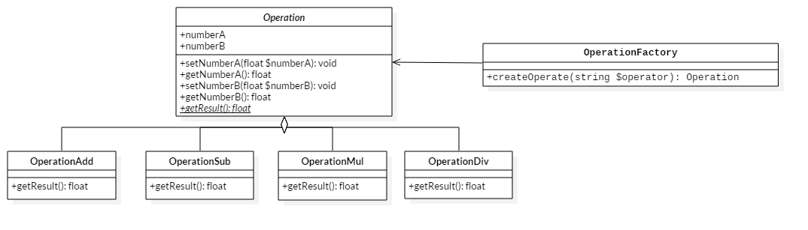

# 简单工厂模式（Simple Factory Pattern）

面向对象编程思想，通过封装、继承、多态把程序的耦合性降低。用设计模式使得程序更加灵活、容易修改、易于复用。

- 可维护：只需修改要修改的地方。
- 可扩展：扩展功能只需加入即可。
- 可复用：功能可以重复使用。

## 版本1
```php
/**
 * 面向对象的计算器
 *
 * 业务和界面逻辑分离
 * 
 * @version 1
 */ 
class Operation
{
    public static function getResult(float $numberA, float $numberB, string $operator) : float
    {
        switch ($operator) {
            case '+':
                $result = $numberA + $numberB;
                break;
            case '-':
                $result = $numberA - $numberB;
                break;
            case '*':
                $result = $numberA * $numberB;
                break;
            case '/':
                if (0 == $numberB) {
                    throw new Exception('numerator can not be zero');                
                }
                $result = $numberA / $numberB;
                break;
        }
        return $result;
    }
}

try {
    $numberA  = 1;
    $numberB  = 0;
    $operator = '/';
    $result   = Operation::getResult($numberA, $numberB, $operator);
    echo sprintf('%.6f %s %0.6f = %0.6f', $numberA, $operator, $numberB, $result);
} catch (Exception $exception) { 
    echo sprintf('[Message]:"%s"', $exception->getMessage());
}
```

## 版本2
```php
/**
 * 面向对象的计算器
 *
 * 1.操作类的继承、多态
 * 2.简单工厂模式
 * 
 * @version 2
 */ 
abstract class Operation 
{
    public $numberA;
    public $numberB;

    public function setNumberA(float $numberA) : void
    {
        $this->numberA = $numberA;
    }

    public function getNumberA() : float
    {
        return $this->numberA;
    }

    public function setNumberB(float $numberB) : void
    {
        $this->numberB = $numberB;
    }

    public function getNumberB() : float
    {
        return $this->numberB;
    }

    abstract public function getResult() : float;
}

class OperationAdd extends Operation
{
    public function getResult() : float
    {
        return $this->numberA + $this->numberB;
    }
}

class OperationSub extends Operation
{
    public function getResult() : float
    {
        return $this->numberA - $this->numberB;
    }
}

class OperationMul extends Operation
{
    public function getResult() : float
    {
        return $this->numberA * $this->numberB;
    }
}

class OperationDiv extends Operation
{
    public function getResult() : float
    {
        if (0 == $this->numberB) {
            throw new Exception('numerator can not be zero');
        }
        return $this->numberA / $this->numberB;
    }
}

class OperationFactory
{
    public static function createOperate(string $operator)
    {
        switch ($operator) {
            case '+' : 
                $operate = new OperationAdd();
                break;
            case '-' :
                $operate = new OperationSub();
                break;
            case '*' :
                $operate = new OperationMul();
                break;
            case '/' :
                $operate = new OperationDiv();
                break;
        }
        return $operate;
    }
}

try {
    $operator         = '/';
    $operate          = OperationFactory::createOperate($operator);
    $operate->numberA = 1;
    $operate->numberB = 0;
    echo sprintf('%.6f %s %0.6f = %0.6f', $operate->getNumberA(), $operator, $operate->getNumberB(), $operate->getResult());
} catch (Exception $exception) { 
    echo sprintf('[Message]:"%s"', $exception->getMessage());
}
```

## UML


