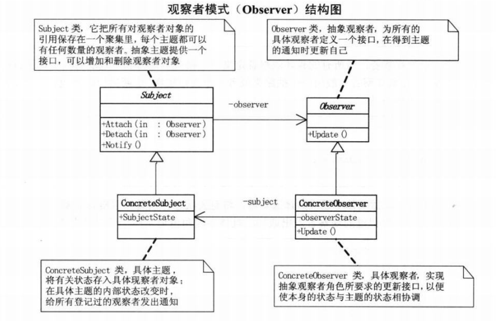

# Observer Pattern（观察者模式）

## 总览

观察者模式定义了一种一对多的依赖关系，让多个观察者对象同时监听某一个主题对象。这个主题对象在状态发生变化时，会通知所有观察者对象，使他们能够自动更新自己。

## 场景

当一个对象的改变需要同时改变其他对象的时候。

## UML



## 事件委托

委托就是一种引用方法的类型。一旦为委托分配了方法，委托将与该方法具有完全相同的行为。委托方法的使用可以像其他任何方法一样，具有参数和返回值。委托可以看作是对函数的抽象，是函数的类，委托的实例将代表一个具体的函数。

一个委托可以搭载多个方法，所有方法被依次唤起，可以使委托对象所搭载的方法不需要属于同一个类。

委托对象所搭载的所有方法必须具有相同的原形和形式，可就是拥有相同的参数列表和返回值类型。

```php
/**
 * PHP事件委托实现
 *
 * @author netsan
 * @example
 *     Event::bind(opt, func);
 *     Event::bind(opt, func);
 *     Event::trigger(opt, args);
 */
class Event
{
    public static $events = []; 

    public static function trigger($event, $args = []) 
    {   
        if (isset(self::$events[$event])) {
            foreach (self::$events[$event] as $callable) {
                call_user_func_array($callable, $args);
            }   
        }   
    }   

    public static function bind($event, Callable $callable)
    {   
        self::$events[$event][] = $callable; 
    }   
}
```


## 代码

```php
abstract class Subject
{
    protected $state;
    protected $observers = [];

    abstract public function attach(Observer $observer);

    abstract public function detach(Observer $observer);

    abstract public function notify();
}

abstract class Observer
{
    protected $name;
    protected $subject = null;

    public function __construct($name, Subject $subject)
    {
        $this->name    = $name;
        $this->subject = $subject;
    }

    abstract public function update();
}

class Boss extends Subject
{
    public function attach(Observer $observer)
    {
        $this->observers[] = $observer; 
    }

    public function detach(Observer $observer)
    {
        unset($this->observers[array_search($observer, $this->observers, true)]);
    }

    public function notify()
    {
        foreach ($this->observers as $observer)
        {
            $observer->update();
        }    
    }

    public function getState()
    {
        return $this->state; 
    }

    public function setState($state)
    {
        $this->state = $state;
    } 
}

class PlayObserver extends Observer
{
    public function update()
    {
        echo sprintf("[Play]:%s,%s\n", $this->name, $this->subject->getState());
    }
}

$boss     = new Boss();
$zhangsan = new StockObserver('zhangsan', $boss);
$lisi     = new StockObserver('lisi', $boss);
$wangwu   = new StockObserver('wangwu', $boss);
$boss->attach($zhangsan);
$boss->attach($lisi);
$boss->detach($lisi);
$boss->attach($wangwu);
$boss->setState('Off work');
$boss->notify();
```

## 参考资料

- [观察者模式应用场景实例](http://blog.csdn.net/swengineer/article/details/6268244)

