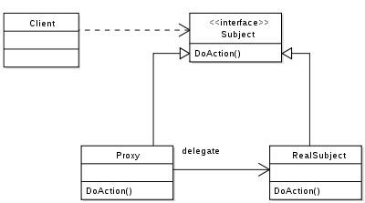

# Proxy Pattern（代理模式）

## 1. 用途

- 提供对象代理来控制访问。
- 使用额外的中间层来支持分布式控制和智能访问。
- 增加包装和委派来保护真实的成员。

## 2. 场景 

### 2.1 远程代理（Remote Proxy）

在分布式对象通讯中，一个本地的对象代表了一个远程对象（这个对象可能从属于不同的地址空间）。本地对象是远程对象的代理，对本地对象方法调用导致对远程对象的方法调用。

### 2.2 虚拟代理（Virtual Proxy）

代替一些复杂或重的对象，在某些情况下，通过单例表示是有益的。

### 2.3 保护代理（Protective Proxy）

基于访问权限对资源访问进行权限控制。

### 2.4 智能代理（Smart Proxy）

当一个对象访问的时候插入附加的动作。

## 3. UML



## 4. 组成

**抽象角色**（Subject）：通过接口或抽象类声明真实角色实现的业务方法。

**代理角色**（Proxy）：实现抽象角色，是真实角色的代理，通过真实角色的业务逻辑方法来实现抽象方法，并可以附加自己的操作。

**真实角色**（RealSubject）：实现抽象角色，定义真实角色所要实现的业务逻辑，供代理角色调用。

## 5. 代码

```php
<?php
/**
 * Proxy design pattern (lazy loading)
 * 
 * @author Enrico Zimuel (enrico@zimuel.it) 
 * @see    https://github.com/ezimuel/PHP-design-patterns/blob/master/Proxy.php
 */
interface ImageInterface
{
    public function display();
}
class Image implements ImageInterface
{
    protected $filename;
    public function  __construct($filename) {
        $this->filename = $filename;
        $this->loadFromDisk();
    }
    protected function loadFromDisk() {
        echo "Loading {$this->filename}\n";
    }
    public function display() {
        echo "Display {$this->filename}\n";
    }
}
class ProxyImage implements ImageInterface
{
    protected $id;
    protected $image;
    public function  __construct($filename) {
        $this->filename = $filename;
    }
    public function display() {
        if (null === $this->image) {
            $this->image = new Image($this->filename);
        }
        return $this->image->display();
    }
}
// Usage example
$filename = 'test.png';
$image1 = new Image($filename); // loading necessary
echo $image1->display(); // loading unnecessary
$image2 = new ProxyImage($filename); // loading unnecessary
echo $image2->display(); // loading necessary
echo $image2->display(); // loading unnecessary
```

## 参考资料

- [Wikipedia Proxy Pattern](https://en.wikipedia.org/wiki/Proxy_pattern)
- [SourceMaking Proxy Pattern](https://sourcemaking.com/design_patterns/proxy)

