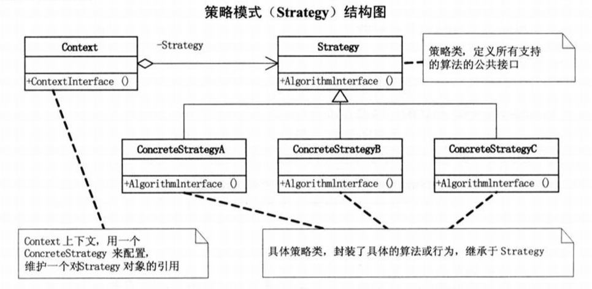

# 2. Strategy Pattern（策略模式）

- [2.1 第一版 商场收银软件](#v1)
- [2.2 第二版 增加打折功能](#v2)
- [2.3 第三版 简单工厂实现](#v3)
- [2.4 第四版 策略模式实现](#v4)
- [2.5 第五版 策略和简单工厂实现](#v4)
- [2.6 算法解析](#analysis)

面向对象编程，并不是类越多越好，类的划分是为了封装，但分类的基础是抽象，具有相同属性和功能的对象的抽象集合才是类。

<h2 id="v1">2.1 第一版 商场收银软件</h2>

缺点：过程性编程，业务和界面过度耦合，不易维护和扩展功能。

```php
/**
 * 商场收银软件
 */
class Window
{
    private $total = 0;//总计
    private $cart  = [];//购物车

    /**
     * 确定
     */
    public function submitBtn(float $price, int $number)
    {
        $this->total += $price * $number;
        $this->cart[] = [
            'price'  => $price,
            'number' => $number 
        ];
    }

    /**
     * 重置
     */
    public function resetBtn()
    {
        $this->total = 0;
        $this->cart  = [];
    }

    /**
     * 购物车
     */
    public function cartTextarea()
    {
        foreach ($this->cart as $item) {
            echo vsprintf("\nPrice:%.2f Number:%d", [
                $item['price'], $item['number']
            ]);
        }
        
    }

    /**
     * 总计
     */
    public function totalLabel()
    {
        echo sprintf("\n-----\nTotal:%.2f\n", $this->total);
    }
}

$window = new Window();
$window->submitBtn(1, 5);
$window->cartTextarea();
$window->totalLabel();

$window->submitBtn(10.5, 1);
$window->cartTextarea();
$window->totalLabel();
```

<h2 id="v2">2.2 第二版 增加打折功能</h2>

缺点：重复代码过多，可利用多态进行重构。

```php
/**
 * 商场收银软件
 */
class Window
{
    private $total = 0;
    private $cart  = [];
    private $type  = ['正常模式', '打8折'];

    public function submitBtn(float $price, int $number, $cash)
    {
        switch ($cash) {
            case 0:
                $total = $price * $number;
                break;
            case 1:
                $total = $price * $number * 0.8;
                break;
            case 2:
                $total = $price * $number * 0.7;
                break;
            case 3:
                $total = $price * $number * 0.5;
                break;
        }
        $this->total += $total;
        $this->cart[] = [
            'price'  => $price,
            'number' => $number,
            'total'  => $total,
            'type'   => $cash  
        ];
    }

    public function resetBtn()
    {
        $this->total = 0;
        $this->cart  = [];
    }

    public function cartTextarea()
    {
        foreach ($this->cart as $item) {
            echo vsprintf("\nPrice:%.2f Number:%d Cash:%s Total:%.2f", [
                $item['price'], $item['number'], $this->type[$item['type']], $item['total']
            ]);
        }
        
    }

    public function totalLabel()
    {
        echo sprintf("\n-----\nTotal:%.2f\n", $this->total);
    }
}

$window = new Window();
$window->submitBtn(1, 5, 1);
$window->cartTextarea();
$window->totalLabel();

$window->submitBtn(10.5, 1, 0);
$window->cartTextarea();
$window->totalLabel();
```

<h2 id="v3">2.3 第三版 简单工厂实现</h2>

简单工厂模式解决的是对象创建的问题。

缺点：工厂包含了所有促销模式，每次扩展都要修改这个工厂。

```php
abstract class CashSuper
{
    abstract public function acceptCash(float $money): float;
}

class CashNormal extends CashSuper
{
    public function acceptCash(float $money): float
    {
        return $money;
    }
}

class CashRebate extends CashSuper
{
    private $moneyRebate;

    public function __construct($moneyRebate)
    {
        $this->moneyRebate = $moneyRebate;
    }

    public function acceptCash(float $money): float
    {
        return $money * $this->moneyRebate;
    }
}

class CashReturn extends CashSuper
{
    private $moneyCondition;
    private $moneyReturn;

    public function __construct(float $moneyCondition, float $moneyReturn)
    {
        $this->moneyCondition = $moneyCondition;
        $this->moneyReturn    = $moneyReturn;
    }

    public function acceptCash(float $money): float
    {
        if ($money >= $this->moneyCondition) {
            return $money - $this->moneyReturn;
        }
        return $money;
    }
}

class CashFactory
{
    public static function createCashAccept(int $type): CashSuper
    {
        switch ($type) {
            case 0:
                $cashAccept = new CashNormal();
                break;
            case 1:
                $cashAccept = new CashRebate(0.8);
                break;
            case 2:
                $cashAccept = new CashReturn(300, 100);
                break;
        }
        return $cashAccept;
    } 
}


/**
 * 商场收银软件
 *
 */
class Window
{
    private $total = 0;
    private $cart  = [];
    private $type  = ['正常模式', '打8折', '满300减100'];

    public function submitBtn(float $price, int $number, $type)
    {
        $cashAccept  = CashFactory::createCashAccept($type);
        $total       = $cashAccept->acceptCash($price * $number);
        $this->total += $total;
        $this->cart[] = [
            'price'  => $price,
            'number' => $number,
            'total'  => $total,
            'type'   => $type  
        ];
    }

    public function resetBtn()
    {
        $this->total = 0;
        $this->cart  = [];
    }

    public function cartTextarea()
    {
        foreach ($this->cart as $item) {
            echo vsprintf("\nPrice:%.2f Number:%d Cash:%s Total:%.2f", [
                $item['price'], $item['number'], $this->type[$item['type']], $item['total']
            ]);
        }
        
    }

    public function totalLabel()
    {
        echo sprintf("\n-----\nTotal:%.2f\n", $this->total);
    }
}

$window = new Window();
$window->submitBtn(1, 5, 1);
$window->cartTextarea();
$window->totalLabel();

$window->submitBtn(10.5, 1, 0);
$window->cartTextarea();
$window->totalLabel();

$window->submitBtn(300, 2, 2);
$window->cartTextarea();
$window->totalLabel();
```

<h2 id="v4">2.4 第四版 策略模式实现</h2>

> 策略模式：定义了算法家族，分别封装起来，让他们之间可以相互替换，此模式让算法的变化，不会影响到使用算法的客户。



```php
abstract class CashSuper
{
    abstract public function acceptCash(float $money): float;
}

class CashNormal extends CashSuper
{
    public function acceptCash(float $money): float
    {
        return $money;
    }
}

class CashRebate extends CashSuper
{
    private $moneyRebate;

    public function __construct($moneyRebate)
    {
        $this->moneyRebate = $moneyRebate;
    }

    public function acceptCash(float $money): float
    {
        return $money * $this->moneyRebate;
    }
}

class CashReturn extends CashSuper
{
    private $moneyCondition;
    private $moneyReturn;

    public function __construct(float $moneyCondition, float $moneyReturn)
    {
        $this->moneyCondition = $moneyCondition;
        $this->moneyReturn    = $moneyReturn;
    }

    public function acceptCash(float $money): float
    {
        if ($money >= $this->moneyCondition) {
            return $money - $this->moneyReturn;
        }
        return $money;
    }
}

class CashContext
{
    private $cashAccept = null;

    public function __construct(CashSuper $cashAccept)
    {
        $this->cashAccept = $cashAccept;
    }

    public function getResult(float $money): float
    {
        return $this->cashAccept->acceptCash($money);
    }
}

class Window
{
    private $total = 0;
    private $cart  = [];
    private $type  = ['正常模式', '打8折', '满300减100'];

    public function submitBtn(float $price, int $number, $type)
    {
        switch ($type) {
            case 0:
                $cashAccept = new CashContext(new CashNormal());
                break;
            case 1:
                $cashAccept = new CashContext(new CashRebate(0.8));
                break;
            case 2:
                $cashAccept = new CashContext(new CashReturn(300, 100));
                break;
        }
        $total = $cashAccept->getResult($price * $number);
        $this->total += $total;
        $this->cart[] = [
            'price'  => $price,
            'number' => $number,
            'total'  => $total,
            'type'   => $type  
        ];
    }

    public function resetBtn()
    {
        $this->total = 0;
        $this->cart  = [];
    }

    public function cartTextarea()
    {
        foreach ($this->cart as $item) {
            echo vsprintf("\nPrice:%.2f Number:%d Cash:%s Total:%.2f", [
                $item['price'], $item['number'], $this->type[$item['type']], $item['total']
            ]);
        }
        
    }

    public function totalLabel()
    {
        echo sprintf("\n-----\nTotal:%.2f\n", $this->total);
    }
}

$window = new Window();
$window->submitBtn(1, 5, 1);
$window->cartTextarea();
$window->totalLabel();

$window->submitBtn(10.5, 1, 0);
$window->cartTextarea();
$window->totalLabel();

$window->submitBtn(300, 2, 2);
$window->cartTextarea();
$window->totalLabel();
```

<h2 id="v5">2.5 第五版 策略和简单工厂实现</h2>

```php
<?php

abstract class CashSuper
{
    abstract public function acceptCash(float $money): float;
}

class CashNormal extends CashSuper
{
    public function acceptCash(float $money): float
    {
        return $money;
    }
}

class CashRebate extends CashSuper
{
    private $moneyRebate;

    public function __construct($moneyRebate)
    {
        $this->moneyRebate = $moneyRebate;
    }

    public function acceptCash(float $money): float
    {
        return $money * $this->moneyRebate;
    }
}

class CashReturn extends CashSuper
{
    private $moneyCondition;
    private $moneyReturn;

    public function __construct(float $moneyCondition, float $moneyReturn)
    {
        $this->moneyCondition = $moneyCondition;
        $this->moneyReturn    = $moneyReturn;
    }

    public function acceptCash(float $money): float
    {
        if ($money >= $this->moneyCondition) {
            return $money - $this->moneyReturn;
        }
        return $money;
    }
}

class CashContext
{
    private $cashAccept = null;

    public function __construct(int $type)
    {
        switch ($type) {
            case 0:
                $this->cashAccept = new CashNormal();
                break;
            case 1:
                $this->cashAccept = new CashRebate(0.8);
                break;
            case 2:
                $this->cashAccept = new CashReturn(300, 100);
                break;
        }
    }

    public function getResult(float $money): float
    {
        return $this->cashAccept->acceptCash($money);
    }
}

class Window
{
    private $total = 0;
    private $cart  = [];
    private $type  = ['正常模式', '打8折', '满300减100'];

    public function submitBtn(float $price, int $number, $type)
    {
        $cashContext = new CashContext($type);
        $total = $cashContext->getResult($price * $number);
        $this->total += $total;
        $this->cart[] = [
            'price'  => $price,
            'number' => $number,
            'total'  => $total,
            'type'   => $type  
        ];
    }

    public function resetBtn()
    {
        $this->total = 0;
        $this->cart  = [];
    }

    public function cartTextarea()
    {
        foreach ($this->cart as $item) {
            echo vsprintf("\nPrice:%.2f Number:%d Cash:%s Total:%.2f", [
                $item['price'], $item['number'], $this->type[$item['type']], $item['total']
            ]);
        }
        
    }

    public function totalLabel()
    {
        echo sprintf("\n-----\nTotal:%.2f\n", $this->total);
    }
}

$window = new Window();
$window->submitBtn(1, 5, 1);
$window->cartTextarea();
$window->totalLabel();

$window->submitBtn(10.5, 1, 0);
$window->cartTextarea();
$window->totalLabel();

$window->submitBtn(300, 2, 2);
$window->cartTextarea();
$window->totalLabel();
```

```php
$cashAccept  = CashFactory::createCashAccept(0);//简单工厂模式
$cashContext = new CashContext(0);//策略模式
```

简单工厂模式：需要客户端认识两个类，CashSuper 和 CashFactory。策略模式：只需要认识一个类 CashContext。通过 getResult 彻底的让客户端和算法隔离。

<h2 id="analysis">2.6 算法解析</h2>

策略模式是一种定义一系列算法的方法，从概念上来看，所有这些算法完成的都是相同的工作，只是实现不同，它可以以相同的方式调用所有的算法，减少了各种算法类与使用算法类之间的耦合。

策略模式的 Strategy 类层次为 Context 定义了一系列的可供重用的算法或行为。继承有助于析取这些算法的公共功能。

策略模式的优点是简化了单元测试，因为每个算法都有自己的类，可以通过自己的接口单独测试。

当不同的行为堆砌在一个类中时，就很难避免使用条件语句来选择合适的行为。讲这些行为封装在一个个独立的 Strategy 中，可以使用这些行为的类中消除条件语句。
